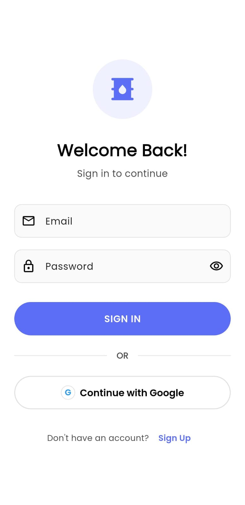

#  NatureDrop - E-Commerce Mobile App for Oil Company

A modern Flutter-based e-commerce application for selling oil products, featuring user and admin roles, real-time inventory management, and seamless shopping experience.

## UI Lookups

| | | | | |
| :---: | :---: | :---: | :---: | :---: |
|  |  |  |  |  |
|  |  |  |  |  |
|  |  |  |  |  |

## Features

### User Features
- **Authentication**: Email/password and Google Sign-In
- **Product Browsing**: Browse products by category with search functionality
- **Shopping Cart**: Add/remove items, adjust quantities
- **Favorites**: Save favorite products for quick access
- **Order Management**: Place orders, track status, and view order history
- **Reviews & Ratings**: Rate and review purchased products
- **Address Management**: Save multiple shipping addresses
- **Profile Management**: Edit personal information, phone, gender, date of birth
- **Location Services**: Location-based features with permission handling
- **Push Notifications**: Order updates and promotional notifications

### Admin Features
- **Dashboard**: Overview of sales, orders, and inventory
- **Product Management**: Add, edit, delete products with image upload
- **Inventory Control**: Track stock levels and manage availability
- **Order Management**: View all orders, update order status
- **User Management**: View user details and manage accounts

## Architecture

### Tech Stack
- **Framework**: Flutter 3.10.7
- **Backend**: Firebase (Authentication, Firestore, Storage, Cloud Messaging)
- **State Management**: Provider
- **UI**: Google Fonts, Lottie animations, Cached Network Images

##  User Roles

### Regular User
- Browse and purchase products
- Manage cart and favorites
- Track orders
- Write reviews

### Admin
- Access via admin email 
- Full product and inventory management
- Order processing and status updates
- User account management

## UI/UX Features
- Clean, modern Material Design interface
- Smooth animations with Lottie
- Responsive layouts
- Loading states and error handling
- Onboarding flow for new users
- Bottom navigation for easy access

##  Supported Platforms
-  Android
-  iOS

##  License
This project is private belongs to Fnext created by Sanjey Sivagurunathan.
